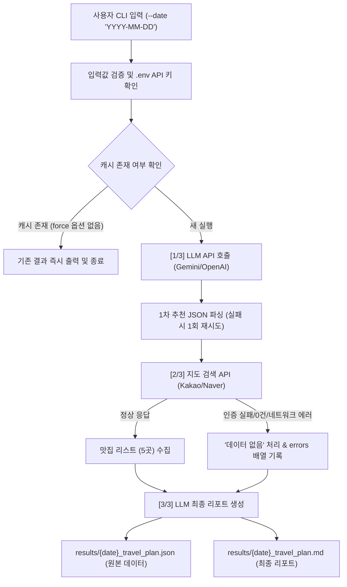

# ✈️ 국내 여행 추천 CLI 프로그램 (Domestic Travel Planner)

> **LLM API**와 **지도/장소 검색 API**를 조합하여 특정 날짜의 국내 여행지, 날씨/행사, 추천 맛집 및 1일 여행 일정을 추천하는 자동화 CLI 프로그램입니다.

---

## 📌 목차
1. [프로그램 개요](#-프로그램-개요)
2. [아키텍처 및 파이프라인 흐름](#-아키텍처-및-파이프라인-흐름)
3. [핵심 학습 목표 및 개념 정리](#-핵심-학습-목표-및-개념-정리)
   - [REST API 구조와 HTTP 메서드 (GET vs POST)](#1-rest-api-구조와-http-메서드-get-vs-post)
   - [LLM 출력의 구조화(JSON)와 파이프라인 연계](#2-llm-출력의-구조화json와-파이프라인-연계)
   - [외부 API 호출 대표 오류와 무중단 대응 원칙](#3-외부-api-호출-대표-오류와-무중단-대응-원칙)
   - [환경변수(.env) 기반 보안 관리 이유](#4-환경변수env-기반-보안-관리-이유)
4. [설치 및 API 키 설정 방법](#-설치-및-api-키-설정-방법)
5. [프로그램 실행 방법](#-프로그램-실행-방법)
6. [결과물 확인 방법](#-결과물-확인-방법)
7. [보너스 기능 안내](#-보너스-기능-안내)
8. [보안 주의사항](#-보안-주의사항)

---

## 📖 프로그램 개요

단일 API 호출을 넘어, **여러 이종(Heterogeneous) API를 순차적으로 엮어 새로운 가치(Insight)를 창출**하는 프로그램입니다.

- **1단계 (LLM 1차 추천)**: 사용자가 입력한 여행 날짜를 분석하여 가장 어울리는 국내 여행 도시, 계절 날씨 요약, 주요 행사/축제 후보, 추천 이유를 구조화된 **JSON**으로 생성합니다.
- **2단계 (지도 검색 API)**: 1차 추천된 도시를 입력값으로 받아, 카카오 또는 네이버 장소 검색 API를 호출하여 **현지 맛집 5곳**의 상세 정보(상호, 주소, 카테고리, 좌표 등)를 수집합니다.
- **3단계 (LLM 최종 리포트)**: 1차 추천 정보와 맛집 검색 데이터, 시스템 오류 내역을 종합하여 여행자를 위한 정갈한 **최종 Markdown 여행 리포트**를 작성합니다.

---

## 🔄 아키텍처 및 파이프라인 흐름



---

## 💡 핵심 학습 목표 및 개념 정리

### 1. REST API 구조와 HTTP 메서드 (GET vs POST)
- **REST API (Representational State Transfer)**: URI로 자원(Resource)을 명시하고, HTTP 메서드를 통해 해당 자원에 대한 행위를 정의하는 아키텍처 스타일입니다.
- **HTTP GET**:
  - **용도**: 서버로부터 데이터를 **조회(Read)**할 때 사용합니다.
  - **특징**: 요청 파라미터가 URL의 쿼리 스트링(`?query=제주+맛집&size=5`)에 노출되며, 브라우저/프록시에 캐싱될 수 있습니다. 멱등성(Idempotent)을 가집니다.
  - **본 프로젝트 적용**: Kakao Local API 및 Naver Local Search API는 장소 정보를 단순히 검색/조회하므로 **`GET`** 메서드를 사용합니다.
- **HTTP POST**:
  - **용도**: 서버에 새로운 데이터를 **생성(Create)**하거나, 요청 본문(Payload/Body)에 복잡한 데이터를 담아 처리할 때 사용합니다.
  - **특징**: URL에 데이터가 노출되지 않고 HTTP Request Body에 JSON 형태로 전달됩니다.
  - **본 프로젝트 적용**: LLM(Gemini, OpenAI)은 대용량 프롬프트, 모델 파라미터, JSON 스키마 등을 전송해야 하므로 **`POST`** 메서드를 사용합니다.

### 2. LLM 출력의 구조화(JSON)와 파이프라인 연계
- LLM은 기본적으로 자유로운 자연어(Text)를 생성합니다. 하지만 자연어는 프로그램 간의 인터페이스로 직접 사용하기 어렵습니다.
- 본 프로그램에서는 프롬프트 엔지니어링(`responseMimeType: "application/json"` 또는 `response_format`)을 통해 LLM이 **엄격한 JSON 스키마**(`recommended_city`, `weather`, `events`, `reason`)를 반환하도록 강제합니다.
- 추출된 `recommended_city` 값은 자연스럽게 다음 단계인 **지도 검색 API의 쿼리 매개변수(`query = f"{city} 맛집"`)**로 연결되어 이종 API 간 데이터 파이프라인이 완성됩니다.

### 3. 외부 API 호출 대표 오류와 무중단 대응 원칙
외부 API는 언제든 실패할 수 있는 분산 환경에 있으므로 **우아한 성능 저하(Graceful Degradation)** 원칙을 준수해야 합니다.
- **인증 오류 (401 / 403)**:
  - 원인: API 키 오타, 만료, 헤더 형식 불일치(`KakaoAK`, `Bearer` 누락 등).
  - 대응: 지도 API 인증 실패 시 프로그램을 강제 크래시하지 않고, 맛집 항목을 "데이터 없음"으로 처리하며 `errors` 리스트에 상세 사유를 기록한 뒤 최종 리포트 생성을 지속합니다.
- **쿼터/속도 제한 오류 (429 Too Many Requests)**:
  - 원인: 무료 티어 분당 호출 수(RPM) 또는 일일 사용량 초과.
  - 대응: 타임아웃 및 재시도 제한(무한 루프 금지) 정책을 둡니다.
- **네트워크/타임아웃 오류 (Timeout / ConnectError)**:
  - 원인: 일시적 인터넷 순단, 원격 서버 응답 지연.
  - 대응: `requests.get(..., timeout=10)`을 필수로 설정하여 프로세스가 멈추는 것을 방지합니다.
- **LLM 파싱 오류 (JSONDecodeError)**:
  - 원인: LLM이 JSON 외 마크다운 코드 블록이나 잡담을 섞어 출력하는 경우.
  - 대응: 정규식 기반 클렌징 시도 후, 실패 시 **최대 1회에 한하여** "오직 순수 JSON만 반환하라"는 강화된 프롬프트로 재요청합니다.

### 4. 환경변수(.env) 기반 보안 관리 이유
1. **코드와 시크릿의 완전 분리**: Git에 코드를 push할 때 비밀키가 공용 레포지토리에 노출되는 보안 사고(비용 청구, 계정 탈취)를 원천 차단합니다.
2. **배포 및 운영 유연성**: API 키가 변경되거나 환경(개발/운영)이 바뀌더라도 소스코드를 수정하지 않고 환경변수 파일만 교체하면 됩니다.
3. **규정 준수**: `.gitignore`에 `.env`를 포함하여 Git 추적 대상에서 완전히 배제합니다.

---

## ⚙️ 설치 및 API 키 설정 방법

### 1. 패키지 설치
Python 3.10 이상 환경에서 의존 패키지를 설치합니다:
```bash
pip install -r requirements.txt
```

### 2. 환경변수 파일(.env) 생성
프로젝트 루트의 `.env.example`을 복사하여 `.env` 파일을 생성합니다:
```bash
# Windows cmd
copy .env.example .env

# Windows PowerShell / macOS / Linux
cp .env.example .env
```

### 3. API 키 입력
`.env` 파일을 열고 사용할 API 키를 입력합니다 (사용하지 않는 키는 비워두셔도 됩니다):

```ini
# --- LLM API (둘 중 하나 필수) ---
# Google Gemini (https://aistudio.google.com/ 에서 무료 발급)
GEMINI_API_KEY=AIzaSy...

# 또는 OpenAI
OPENAI_API_KEY=sk-...

# --- 지도 / 장소 검색 API (둘 중 하나 권장) ---
# Kakao Local REST API Key (https://developers.kakao.com/)
KAKAO_REST_API_KEY=1234567890abcdef...

# 또는 Naver Search API (https://developers.naver.com/)
NAVER_CLIENT_ID=your_client_id
NAVER_CLIENT_SECRET=your_client_secret
```

---

## 🚀 프로그램 실행 방법

### 기본 실행 (단일 추천)
```bash
python travel_planner.py --date "2026-05-15"
# 또는
python travel_planner.py -date "2026-05-15"
```

### 실행 출력 예시
```text
==================================================
  국내 여행 플래너 실행: 2026-05-15
==================================================

[1/3] 1차 추천 생성 중(LLM)...
  - recommended_city: "강릉"

[2/3] 맛집 검색 중(지도/장소 API)...
  - 맛집 5곳 검색 완료

[3/3] 최종 리포트 생성 중(LLM)...
  - 리포트 생성 완료

==================================================
완료! 결과물이 성공적으로 저장되었습니다:
  - 원본 JSON: results\2026-05-15_travel_plan.json
  - 여행 리포트: results\2026-05-15_travel_plan.md
==================================================
```

---

## 📂 결과물 확인 방법

실행이 완료되면 `results/` 폴더에 2개의 파일이 생성됩니다:

1. **원본 데이터 JSON (`results/{date}_travel_plan.json`)**:
   - LLM 1차 추천 결과(도시, 날씨, 축제, 추천 근거)
   - 장소 검색 API로 수집된 맛집 5곳의 상세 정보(좌표, 주소, 상호명 등)
   - API 호출 과정에서 발생한 에러 요약(`errors` 배열)
2. **최종 마크다운 리포트 (`results/{date}_travel_plan.md`)**:
   - 추천 지역 및 테마
   - 날씨 및 추천 옷차림
   - 지역 축제/행사 정보
   - 맛집 리스트 (검색 실패 시 '데이터 없음'으로 안전 표기)
   - 오전/오후/저녁 1일 여행 추천 코스
   - 시스템 오류 요약

---

## 🌟 보너스 기능 안내

1. **결과 캐싱 최적화 (`--force` / `--no-cache`)**:
   - 동일한 날짜로 다시 실행할 경우 불필요한 API 과금 및 지연을 방지하기 위해 기존 `results/` 파일의 결과를 확인하고 즉시 안내합니다.
   - 강제로 다시 생성하려면 `--force` 옵션을 붙여 실행합니다:
     ```bash
     python travel_planner.py --date "2026-05-15" --force
     ```
2. **복수 지역 추천 (`--multi`)**:
   - 1개 도시가 아닌 2~3개 후보 도시를 동시에 추천받고, 각 도시별 맛집을 복수 검색하여 비교할 수 있습니다:
     ```bash
     python travel_planner.py --date "2026-10-09" --multi
     ```

---

## 🔒 보안 주의사항

- **절대 커밋 금지**: `.env` 파일은 실제 서비스 과금이 발생할 수 있는 비밀키를 담고 있으므로 절대 Git에 추가하거나 외부에 노출해서는 안 됩니다.
- 본 프로젝트는 `.gitignore`에 `.env` 및 `results/`를 기본 등록하여 안전하게 보호하고 있습니다.